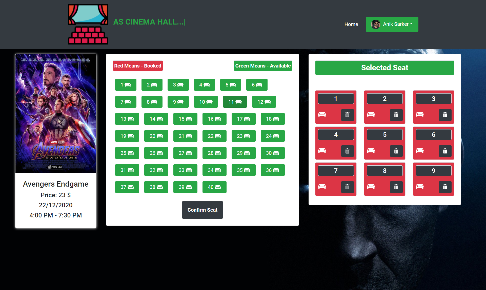

# as-cinema-hall

This is a movie ticket booking website.

# About Project Technology:
* React JS (Frontend Framework)
* Bootstrap
* Express JS (Backend Framework)
* MongoDB (Database)
* Firebase (Hosting & google Authentication)
* Heroku (Server side deployment)

# Project ScreenShot

### Home page

### Login page

### Booking page

### Booking Details page

# Live Website link
[website](https://as-cinema-hall.web.app/)

# Server link
[website](https://as-cinema-hall.herokuapp.com/)